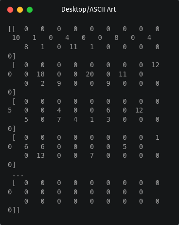

# ASCII Art API in FastAPI

## Introduction
In this tutorial, you will learn how to create an ASCII art API that can convert both text and images to ASCII. You will start by learning what an image file really is, and then you will build an API that will generate ASCII ART for you given the required image or text. By the end of this tutorial, you will have a working API that you can use to create ASCII art from any image or text.

### Requirements
To create this API, we'll need:
* [Python](https://www.python.org/) 3.6+ installed
* [Git](https://git-scm.com/)

### Setting Up Our Environment
We will create a virtual Python environment using Venv. Firstly, lets create a local directory. This directory will be called ASCII Art, then you should open the terminal in this directory. To create the Virtual Environment enter the command:

```
python -m venv env
```
__note__ : Depending on how you set up your Enviroment variables when you installed python the above command might not work. If the above command does not work switch the `python` part with `python`.  If this change fails then plaese go to this [link](https://docs.python.org/3/library/venv.html) or [this one](https://www.freecodecamp.org/news/how-to-setup-virtual-environments-in-python/) for extra information

To activate the virtual environment using the following command for your operating system

* **Linux/MacOSX:**  
```
source env/bin/activate
```

* **Windows:**  
```
source env\Scripts\activate.bat
```

if the virual environment activated correctly, you should see (env) to the left of your name in the terminal. It should look something like this:


### Installing Dependencies
Now that we've got our virtual environment set up, we can look at the packages we're gonna use:

* [Pillow](https://pillow.readthedocs.io/en/) is a fantastic Python package that allows us to process and manipulate images.
* [FastAPI](https://fastapi.tiangolo.com/) is a web development framework that provides tools that make it easy for building, documenting and maintaining APIS
* [NumPy](https://numpy.org/) is a library used for scientific computing which will come in handy manipulating images.
* [unicorn](https://pypi.org/project/unicorn/) is a server that will help serve our API 

```
pip install numpy, pillow, fastapi , "uvicorn[standard]"
```

__note__ : if pip does not work you can try `pip3` instead.

### Downloading test images 
we will also need some test images to help us convert and test our API. Please create a new folder in your project directory called Test images. After this we need to download the images from our [Github respository](https://github.com/maybe-raymond/ASCII-API) in the folder called Test images.


## What the Devil is ASCII art ?
ASCII art is just representing pictures as letters and symbols. The ASCII part of the name just represents the character set we are going to us to make our images.

Here's an example of a simple cat in ASCII:
```
 /\_/\
( o.o )
 > ^ <
```


As we can see the image is just made up of letters and symbols. we are going to be doing something like this but we will be converting actual images to ASCII art text. 

Now that we know what ASCII art is we can move to the coding section, but first neeed to answer an important question. 


## What really is a digitial image ?
Computers interpert visual images in formats such as `.png, jpeg and webp` as a two dimensional(2D) array or a matrix.These matrix's store the value of every pixel.Some image formats represent images as three dimensional(3D) arrays were the value of the inner array is another array of RGB vaules. The best way to understand all this is by doing. 

Let's create a file called `image_test.py`. we will first import the Image class from the Pillow package and then we import numpy. We then open an image in out `Test images` folder using the Image class. The function np.asarray just converts an image into it's representation as an array. We then print this array.

```
from PIL import Image
import numpy as np 


with Image.open("Test images/Zero.jpg") as img: # opening image
    data = np.asarray(img) # converting img to array
    print(data)

```

When we run the file, we should some output which looks like this



As we can see the image is just an array of array with numbers. These numbers will represent a values between 0 and 255. The image we converted is grayscale and so is not in the RGB format. so the images represent the brightness or intensity of the value, where 0 is black and 255 is white. if it was in RGB the values would become an an array and be in the format of (R, G, B) were each number represents the colour of the pixel. For example the colour of orange of a singular pixel will be (255, 165, 0) which represents the intensity of the colours Red, Green and Blue.

## Let's convert our Image to ASCII
As we learned above the ASCII art is just making an image out of letters and symbols. We also just learnt that an image is just a bunch of pixel values in an array of arrays. So to convert an iamge to ASCII we just need to convert each pixel value into some value that corresponds to an ASCII symbol

Open up `image_test.py` and create a new function called `matchToASCII` that will match a pixel value to an ASCII value. it should look something like this


```
def matchToASCII(symbol):
    chars = ["!", "#", "$", "%", "&"]
    
    if symbol < 50:
        return chars[0]
    elif symbol < 100 :
        return chars[1]
    elif symbol < 150:
        return chars[2]
    elif symbol < 200:
        return chars[3]
    else:
        return chars[4]

```

